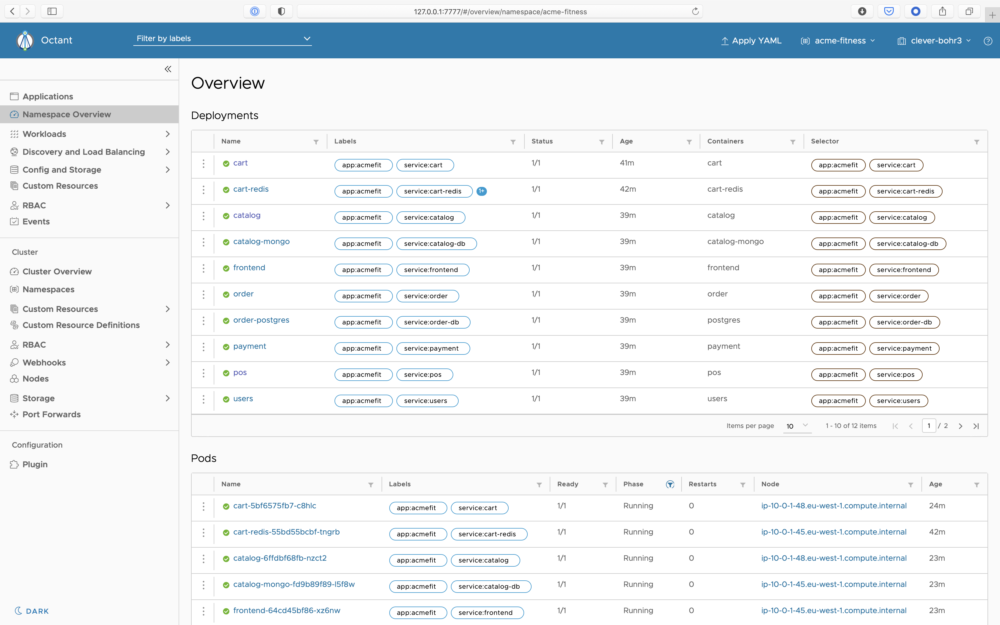
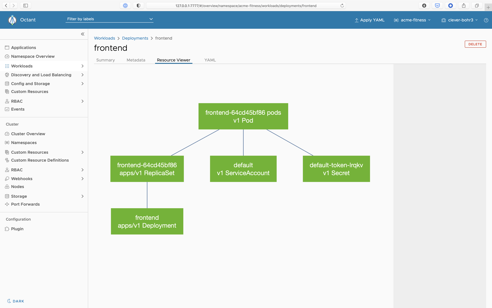

We are constantly presented with new tools all the time; scripts, themes, or even code editors. We try them, we forget about them, and before you know it a `brew update` take minutes rather than seconds to run. The few tools that do tend to stick around are those that solve a real need. Octant is one such tool. It's not just the latest addition to my toolbox, it's one that I'm turning to with increasing regularity.

<table>
    <tr>
        <td>🔧 Name</td><td>Octant</td>
    </tr>
    <tr>
        <td>📃 Description</td><td>Visualize your Kubernetes workloads</td>
    </tr>
    <tr>
        <td>📅 Released</td><td>August 2019</td>
    </tr>
    <tr>
        <td>🔗 Site</td><td><a href="https://octant.dev/">https://octant.dev</a></td>
    </tr>
</table>

Released as a VMware[^1] backed project in August 2019, Octant was the result of a conversation between Bryan Liles ([@bryanl](https://twitter.com/bryanl)) and Joe Beda ([@jbeda](https://twitter.com/jbeda)) where they explored a common, but frequently overlooked, question.

[^1]: VMware is my current employer.

> What is hard about Kubernetes?

When helping customers tackle the challenges of Kubernetes, I find I'm often having to explain or demonstrate application deployments. In doing so, I'm faced with a choice.

* **Keep it simple** - Deploy and expose Nginx. It works, but it's unimpressive and doesn't feel like a real-world deployment.
* **Get fancy** - Deploy a more complex [demo app](https://www.virtuallyghetto.com/2020/06/interesting-kubernetes-application-demos.html) - It's impressive and feels far more realistic, but it's difficult to visualise.

While it is possible to explore a more complex Kubernetes deployments using `kubectl` it is hard enough to navigate the resource graph when you are the one with your hands on the keyboard. It's far more challenging to follow along on a Zoom call.



Octant solves this problem by allowing me to show resource state along with a graphical relationship between resources. It does much more than this, but it is this feature alone that has me reaching for it several times a day. If you have access to a working Kubernetes cluster, you can try this now.

```plain
brew install octant
```

```plain
octant
```

Octant began with a simple purpose, to answer the question "[Is my Application Up?](https://twitter.com/bryanl/status/1159088266966163456?s=20)" But Octant has continued to evolve and now packs some impressive features:

* Single local binary installation
* Comprehensive workload summary
* Uses your local `KUBECONFIG`
* Port forwarding, from the browser
* Log streaming to the browser
* In-browser YAML editor
* Extensible through plugins

If you work with Kubernetes, I recommend you give Octant a try. If you want to hear more about the origins of Octant from Bryan Liles himself, listen to this episode of the GoTime Podcast: [Enterprise Go?](https://changelog.com/gotime/124).
