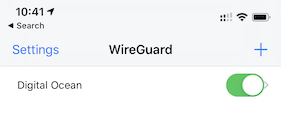

# WireGuard - The Best VPN Yet

There are two reasons I regularly use a VPN connection on my portable devices; to give myself some privacy when using untrusted networks and to get around network filtering or censorship when traveling abroad. Over the years I've switched between running my own VPN endpoint and paying for a subscription with one of the popular providers. I've recently settled on a new favourite, WireGuard. I've found it to be fast, stable, and unusually tolerant of an unstable network. In this post I'll take you through how to get set-up with your very own WireGuard VPN.

## WireGuard Set-Up

The WireGuard [installation instructions](https://www.wireguard.com/install/) are relatively straightforward but I ended up tripping over myself for two reasons:

- The instructions seem to assume you are setting up a VPN between two servers and not a mobile device.
- Consequently, I misunderstood how IP addresses were supposed to be allocated to peers.

The instructions below are intended to help avoid these pitfalls.

### Installation

There are four main steps to setting up a WireGuard VPN:

1. Provision (or re-use) a server
2. Install the WireGuard software
3. Generate key pairs
4. Configure your peers

Although WireGuard is build as a peer-to-peer VPN, for an individual use-case it may be easier to think of it in terms of client and server as you work through the installation.

Our fist peer (think of it as a server) will be a Linux machine hosted by Digital Ocean. Our second peer (the client) will be a mobile device running iOS. It is important to note that the WireGuard software is available for most platforms so feel free to pick a different hosting provider. Equally, your client could be another Linux server, a laptop running Mac OS or an Android device.


#### Linux

I ran my server on Digital Ocean using the smallest droplet available. This costs just $5/month and should leave you enough headroom to host a number of small projects on the same droplet.

* Ubuntu 18.04.3 (LTS) x64
* Standard Plan
* 1 GB/1CPU
* 25 GB SSD
* 1000 GB transfer
* $5/mo or $0.007/hour

When choosing your region, remember that when you use your VPN, your traffic will appear to come from the region in which you deploy your server. I picked London as it's close to home, but pick the region that most makes sense for you. If travelling in Asia for example, it might make sense to deploy in Singapore.

If you don't yet have a Digital Ocean Account, this referral link will give you [$100 credit](https://m.do.co/c/180ade3e9e88) to use.

You'll need to wait a couple of minutes for the Droplet to be created. You should then be able to connect to it over SSH using the public IP address assigned to the machine.

Assuming you are using Ubuntu, you can install WireGuard using the `apt` package manager. If you aren't, [WireGuard Installation](https://www.wireguard.com/install/) instructions are available for all major operating systems.

```
sudo apt update -y
sudo apt upgrade -y
sudo add-apt-repository ppa:wireguard/wireguard
sudo apt install wireguard -y
```

#### iOS

The WireGuard app is available on the iOS [App Store](https://apps.apple.com/us/app/wireguard/id1441195209).

If you aren't using iOS, the full list of supported platforms can be found in the [installation](https://www.wireguard.com/install/) section of the WireGuard website.

### Key Generation

Each of your peers will need a public/private key pair. You can generate these directly on each client, but I chose to generate both pairs on the server for convenience.

For the server:

```
umask 077
wg genkey | tee server_privatekey | wg pubkey > server_publickey
```

For the client:

```
umask 077
wg genkey | tee mobile_privatekey | wg pubkey > mobile_publickey
```

You'll need these keys during the configuration steps.

### Configuration

Before I jump in and tell you how to configure WireGuard I found it useful to understand what we are configuring.

WireGuard establishes a connection between peers. It does this by creating a new network interface on each peer and assigning it an IP address. You specify which IP address allocated to each peer as part of the configuration. Each peer must be allocated a unique address. The thing that wasn't immediate to me was that these addresses should come from an internal address range. We are building up a new network between peers. I chose to use the range below, but you are free to use any of the [standard internal address ranges](https://en.wikipedia.org/wiki/Private_network).

- `Peer 1` (server): `10.10.0.1`
- `Peer 2` (client 1): `10.10.0.2`
- `Peer 3` (client 2): `10.10.0.3`
- etc.

When the WireGuard interface is brought online, peers will be able to communicate using this new internal network. Two allow us to route traffic from this new private network out to the internet, we will add a couple of routing rules that tell the server to route traffic out over its external network interface. We do this using `iptables`.

Although it is possible to manually create, configure and bring up the network interface on the server. We are going to be using a helper tool, `wg-quick`, that comes as part of the WireGuard installation. By convention `wg-quick` expects the configuration for our new interface, called `wg0` to be stored in the following location: `/etc/wireguard/wg0.conf`. 

Now that we understand what we are configuring, we need to create two configuration files. One for the server, and another for the client.

#### Server Configuration

Server configuration contains two sections; `[Interface]` where we define the set-up of the `wg0` interface, and `[Peer]` where we describe details of our client.

**Interface:**
- `Address` is the IP address (IPv4 or IPv6) of the server.
- `ListenPort` is the port on which you'd like WireGuard to listen. You should have no need to change the default, but remember to open up any firewalls you may have.
- `PrivateKey` is the contents of the server's private key file.
- `PostUp` commands to execute when the interface is brought up.
- `PostDown` commands to execute when the interface is torn down.

**Peer**
- `PublicKey` is the public key of the peer (or client).
- `AllowedIPs` are the IP addresses you allocated to the peer.

This is the complete configuration I used for the server (with keys masked out): save in `/etc/wireguard/wg0.conf

```
[Interface]
Address = 10.10.0.1/24
Address = fd86:ea04:1111::1/64
ListenPort = 51820
PrivateKey = *****************************=
PostUp = iptables -A FORWARD -i wg0 -j ACCEPT; iptables -t nat -A POSTROUTING -o eth0 -j MASQUERADE; ip6tables -A FORWARD -i wg0 -j ACCEPT; ip6tables -t nat -A POSTROUTING -o eth0 -j MASQUERADE
PostDown = iptables -D FORWARD -i wg0 -j ACCEPT; iptables -t nat -D POSTROUTING -o eth0 -j MASQUERADE; ip6tables -D FORWARD -i wg0 -j ACCEPT; ip6tables -t nat -D POSTROUTING -o eth0 -j MASQUERADE
SaveConfig = true

[Peer]
PublicKey = *****************************=
AllowedIPs = 10.10.0.2/32, fd86:ea04:1111::2/128
```

If you have more than one peer (or client), replicate the `[Peer]` section and modify the values for `AllowedIPs` and `PublicKey` accordingly.

We need to tell our server that it is allowed to forward packets between network interfaces. This is typically disabled by default.

```
cat << EOF >> /etc/sysctl.conf
net.ipv4.ip_forward=1
net.ipv6.conf.all.forwarding=1
EOF
sysctl -p
```

If you are running a firewall, don't forget to open the port. This isn't enabled by default on the Digital Ocean image so you can skip this step. If you are unsure, check if the firewall is running.

```
sudo ufw status verbose 
```

If this shows as inactive, which it will do on a default DigitalOcean image, then you can skip the next step.

```
sudo ufw allow 51820/udp
sudo ufw status
```

Now that you've set everything up, configure the WireGuard service to start on boot.

```
sudo systemctl enable wg-quick@wg0
```

Finally start the WireGuard interface.

```
sudo systemctl start wg-quick@wg0
```

#### Client Configuration

The configuration for the mobile client is very similar.

**Interface:**

- `Address` is the IP address (IPv4 or IPv6) of the client.
- `DNS` is the DNS server you'd like the client to use. I'm using [CloudFlare DNS](https://1.1.1.1) here.
- `PrivateKey` is the contents of the client's private key file.

**Peer:**

- `PublicKey` is the contents of the server's public key file.
- `AllowedIPs` are the IP addresses you would like the client to route to the server (here, we route everything)
- `EndPoint` is the public IP address (and the port) of your DigitalOcean server
- `PersistentKeepAlive` instructs the client to send a keep alive message

This is the complete configuration I used for the client (with keys masked out): save in `~/mobile.conf`

```
[Interface]
Address = 10.10.0.2/32
Address = fd86:ea04:1111::2/128
PrivateKey = *****************************=
DNS = 1.1.1.1

[Peer]
PublicKey = *****************************= 
AllowedIps = 0.0.0.0/0
Endpoint = xxx.xxx.xxx.xxx:51820
PersistentKeepAlive = 15
```

The easiest way to transfer the client configuration to your phone is through a QR code.

```
sudo apt install qrencode -y
qrencode -t ansiutf8 < ~/mobile.conf
```

Open the WireGuard app on your phone and scan the QR code that is displayed in your terminal.

### Run

With both our client and server now configured, it's time to get things running and test our VPN.

#### Server

```
systemctl start wg-quick@wg0
```

#### Client

Open the WireGuard App and enable the connection.



### Check things are working

You can view the status of WireGuard to confirm your interface is up and WireGuard is aware of your peers.

```
wg show
```

If things are working you should see output similar to that shown below.

```
interface: wg0
  public key: *****************************=
  private key: (hidden)
  listening port: 51820

peer: *****************************=
  endpoint: 133.124.***.7:31139
  allowed ips: 10.10.0.2/32, fd86:ea04:1111::2/128
  latest handshake: 3 days, 8 hours, 55 minutes, 26 seconds ago
  transfer: 8.99 GiB received, 9.13 GiB sent
```

As a final check, I would always reboot the server to confirm that everything comes back up on a server restart. You don't want to find yourself unable to use the internet because the server restarted while you were away.

## Conclusion

All being well, you should now have your very own WireGuard VPN set-up on your mobile. This is the most basic set-up but it has served me well so far.

Some things you could consider next:

- Add additional clients (e.g. your laptop, tablet, etc.).
- Route DNS traffic over the VPN to avoid DNS leaks.
- Pair up with friends to build out endpoints in different regions.

When this all gets too much to manage and you'd rather buy a professionally run VPN service, I've had best luck with [Express VPN](https://www.expressrefer.com/refer-friend?referrer_id=8712203&utm_campaign=referrals&utm_medium=copy_link&utm_source=referral_dashboard). With endpoints available in 94 countries, this would be my choice if you needed to vary where your traffic came from.

If you have any questions or get stuck following these instructions, you can find me on [Mastodon](https://social.glvr.io/@bill) or on [Twitter](https://twitter.com/billglover).
